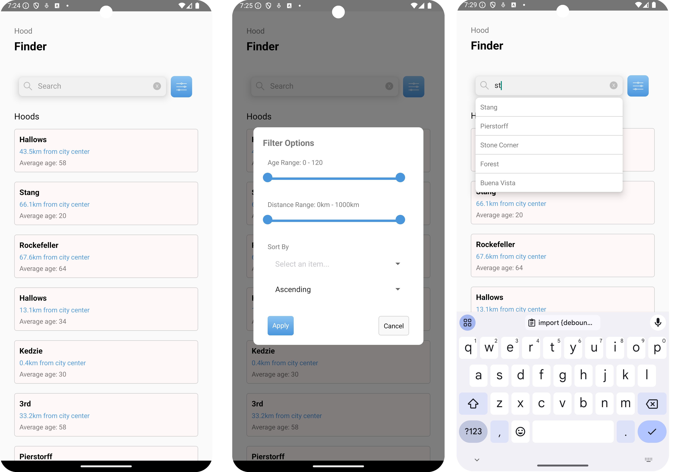

# Venn App Development Setup

## Overview
This document provides a guide on setting up the development environment for the mobile application. The application is built using React Native, a JavaScript framework for developing mobile applications. The application is designed to run on both iOS and Android platforms.

## Screenshots


## important notes 

* **Make sure running the backend server before running the mobile app.**
* **Change the baseURL in `src/services/api.ts`:**
- src
   - services
      - api.ts
   - components
   - utils 
* **The IP address shoulde be ipv4 address of the machine running the backend server.**
* **Example of baseURL:**
``` 
import axios from 'axios';

const api = axios.create({
  baseURL: 'http://10.0.0.1:3000',
  headers: {
    'Content-Type': 'application/json',
  },
});

export  { api  }
```

To commence the setup process,  follow the steps outlined below:

1. Execute the command: 
   ```
   yarn install
   ```
   or 
   ```
   pnpm install
   ```
   or
   ```
   npm install
   ```

2. Configure your development environment for iOS or Android by referring to the guidelines provided in the following link: [React Native Environment Setup Guide](https://reactnative.dev/docs/environment-setup?guide=native).

3. Initiate the development server by running the command:
   ```
   yarn start
   ```

4. Depending on your chosen platform in step 2, execute either of the following commands:
   ```
   yarn ios
   ```
   or
   ```
   yarn android
   ```

These steps will ensure the proper setup and initiation of your React Native development environment.